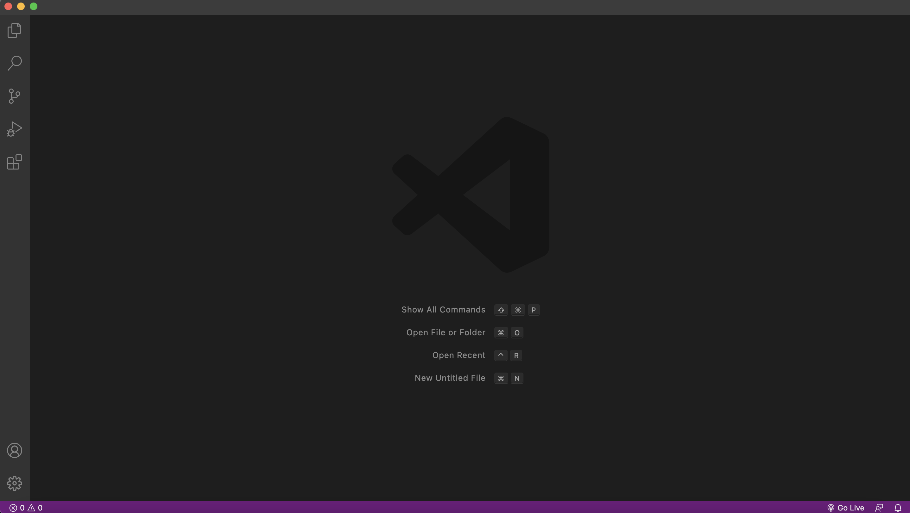
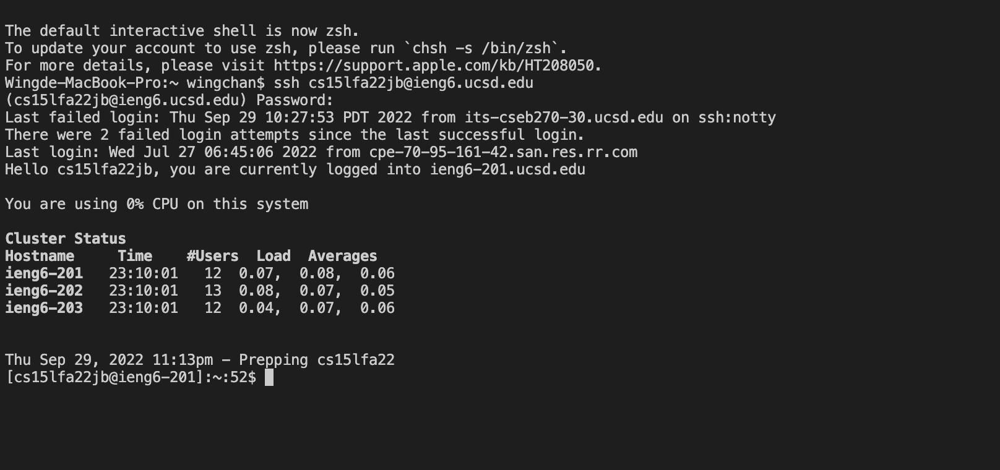
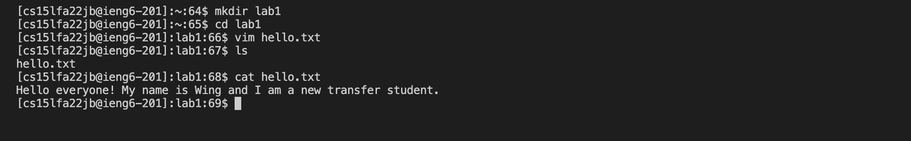
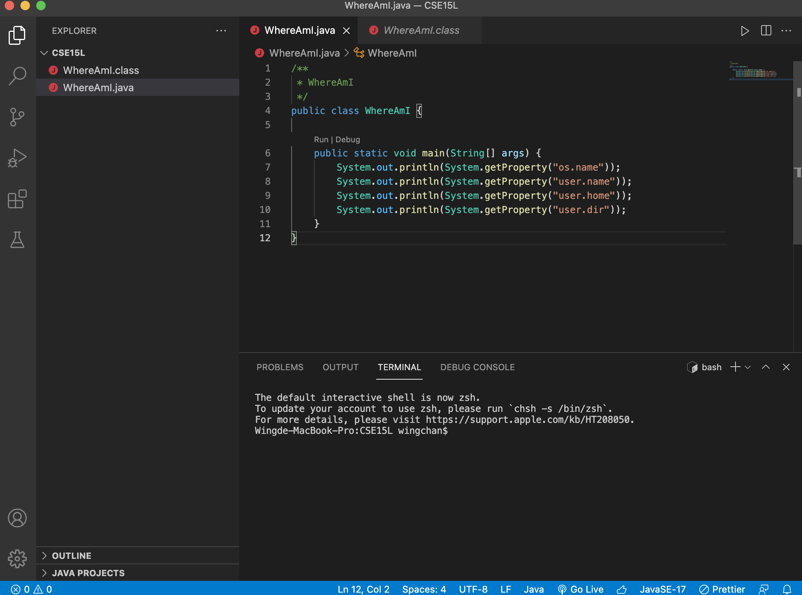
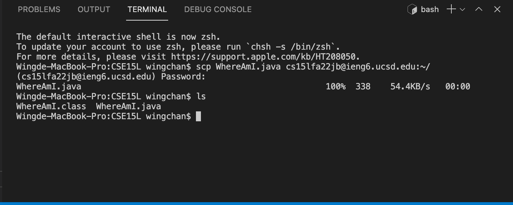
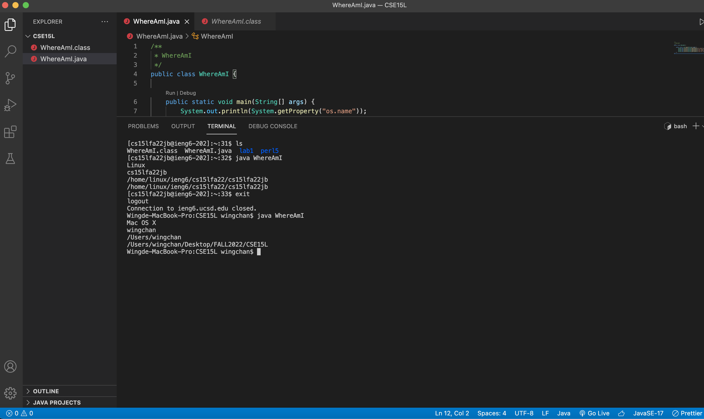
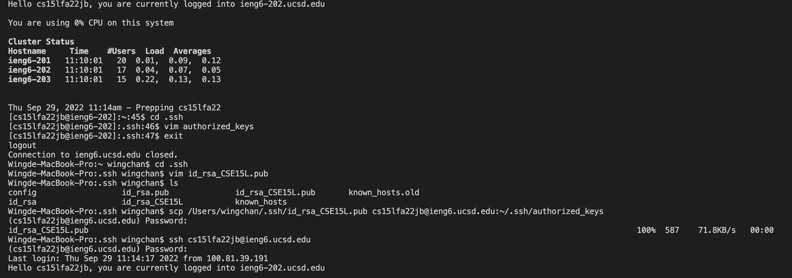

# **Week1 Lab Report**

Today is our first lab and we learn how to connect to the remote server, ieng6, using ssh and copy files from our client to the remote server.

---

### **step 1: Connect your account to ieng6**

1. Go to [here](https://sdacs.ucsd.edu/~icc/index.php) to find your account by using your ucsd username and student ID
2. Open VScode
   
3. Use the follow code to login into ieng6 and type your password

```
ssh cs15lfa22jb@ieng6.ucsd.edu
```



### **step 2: Try out different commands**

- From the above code, I use `mkdir` to create a new directory called lab1. I then `cd` to lab1 and create a hello.txt file adding some context. I use `ls` to show what is inside the lab1 file. Then, I use `cat hello.txt` to print out the context.
  

### **step 3: Create a file in your client**

- Create a WhereAmI.java file with multiple getProperty functions
  > We will be using getProperty functions to see the different between running file in client and remote server
  > 

### **step 4: Copy the file from your client to the remote server**

- To copy file from client to ieng6 server, we will use the follow code:

```
scp WhereAmI.java cs15lfa22jb@ieng6.ucsd.edu:~/
```

- In this case, `scp` is the command to do the copy.
- `WhereAmI.java` is the target file.
- `cs15lfa22jb@ieng6.ucsd.edu:~/` is the target directory
  

### **step 5: Run the file in both your client and the remote server**

- Login to your account and run the WhereAmI.java on the server by using `javac WhereAmI.java` and `java WhereAmI`
- Now `exit` the server and run the WhereAmI.java again
- You will see that getProperty return different values depends on where you run the code
  

### **step 6: Generate SSH keys and copy it to the server**

- To be more effcient, we can copy our SSH keys to the server.
- This step allows we to login the ieng6 server directly without password.

```
ssh-keygen
```

The above code is going to generate ssh keys for us (public and private keys). In my case, I have already generated keys for my other class using the default path. So, I rename the file to id_rsa_CSE15L\
Use the same command `scp` as previous to copy our public key to ieng6

```
scp /Users/wingchan/.ssh/id_rsa CSE15L.pub cs15lfa22jb@ieng6.ucsd.edu:~/.ssh/authorized keys
```

Now when you connect to the server, it won't ask you the password again.\

As you see, mine doesn't work. It is still asking me the password. I guess it is relate to the name that I have changed because it works in my other class by using the default path.

---

That's what we did today in lab.\
[Return to the main page](index.md)
