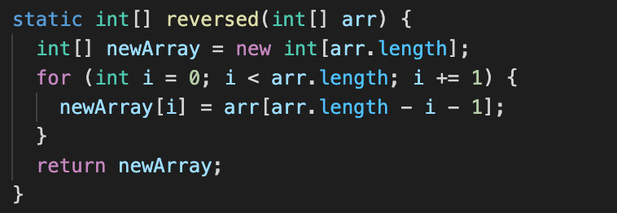

# **Week 3 Lab Report 2**

## **Part 1**

Here is the code for my Simplest Search Engine from week 2:

```
import java.io.IOException;
import java.net.URI;
import java.util.*;

class Handler implements URLHandler {
    // The one bit of state on the server: a number that will be manipulated by
    // various requests.
    List<String> list = new ArrayList<String>();

    public String handleRequest(URI url) {
        if (url.getPath().equals("/")) {
            return String.format("Hi!");
        } else if (url.getPath().equals("/increment")) {

            return String.format("Number incremented!");
        } else {
            System.out.println("Path: " + url.getPath());
            if (url.getPath().contains("/add")) {
                String[] parameters = url.getQuery().split("=");
                if (parameters[0].equals("s")) {
                    list.add(parameters[1]);
                    return String.format("String added: %s!", parameters[1]);
                }
            } else if (url.getPath().contains("/search")) {
                List<String> temp = new ArrayList<String>();
                String[] parameters = url.getQuery().split("=");
                if (parameters[0].equals("s")) {
                    for (int i = 0; i < list.size(); i++) {
                        if (list.get(i).contains(parameters[1])) {
                            temp.add(list.get(i));
                        }
                    }
                }
                return String.format("Find Strings: %s", temp.toString().replace("[", "").replace("]", ""));
            } else if (url.getPath().contains("/show")) {
                return String.format("Show all String: %s", list.toString().replace("[", "").replace("]", ""));
            }
            return "404 Not Found!";
        }
    }
}

class SearchEngine {
    public static void main(String[] args) throws IOException {
        if (args.length == 0) {
            System.out.println("Missing port number! Try any number between 1024 to 49151");
            return;
        }

        int port = Integer.parseInt(args[0]);

        Server.start(port, new Handler());
    }

}
```

### Screenshot 1 & 2

In this screenshot, I am only calling the handleRequest method. First, this method will check if there is a path after `/`. In this case, I have add `/add` in my URL so the value of `url.gethPath()` is going to be `/add` and the value of `url.getPath().contains("/add")` is true. Then, `url.getQuery()` is `?s=apple` and `?s=application` for screenshot1 & 2 respectively. `parameters[0]` is going to store the first string, in this case which is `s`, so `parameters[0].equals("s")` will return true and it will add the second string `parameters[1]` to the list. In screenshot1 `parameters[1]` is apple whle in screenshot2 `parameters[1]` is application. When the request is done, all those values will stay the same until I have made a new reuqest. That is because the website is keep running so it keeps listening to my request.


### Screenshot3

In this screenshot, I am only calling the heandleRequest method. The values of `url.getPath()` is `/search` and `url.getPath().contains("/search")` is true. `url.getQuery()` is `?s=app`. parameters[0] is `s` and parameters[1] is `app`. The String List `temp` has value `apple` and `application` because both contains `app`. When the request is done, same as above, all those values will stay the same until I have made a new reuqest except `temp` as it is a local variable.


### Screenshot4

In this screenshot, I am only calling the heandleRequest method. The values of `url.getPath()` is `/show`. The list has string `"apple"`, `"application"` and `"banana"`. When the request is done, `url.getPath()` will still be `/show` until I change the path to other. Since list is a variable outside the `handleRequest()`, its values won't disapear and it only can be added by using the `/add` path with query.


## **Part 2**

### Bug 1: reversed() from ArrayExamples

The failure-inducing input is:

Junit Test:

From the Junit test, we can see the symptom is that the function supposes to reverse the array from {1, 2, 3} to {3, 2, 1}. However, the actual output at index[0] in the array is 0.\
Here is the original code of the function:

For the bug, there are a few thing need to be fixed:

1. It should assign the value from arr to newArray
2. It should return the newArray instead of arr\
   The reasons why we are getting this symptom is because

```
int[] newArray = new int[arr.length]
```

is going to initialize newArray with all 0 values. The function is assigning the value of newArray to arr, means assigning 0 to arr, and it is returning the arr instead of newArray. The return value would be arr with a bunch of 0 values.\
After fixed the bug, the code should be:


---

### Bug 2: append() from LinkedListExamples

The failure-inducing input is:

Junit Test:

From the Junit test, we can see the symptom is that the function supposes to should the last element of the linked list, which is 9. However, it goes to an infinite loop until I pressed control + z to stop it. \
Here is the original code of the function:

One thing need to be fixed for this bug is to move the `n.next = new Node(value, bull)` outside the while loop.
The reasons why we are getting this symptom, infinite loop, is because

```
n.next = new Node(value,bull)
```

is going to add a new Node at the end of the linked list forever so it never reaches the null and never end the while loop. In our testing case, when `n = 2`, we assign `n.next` to `9` and back to the while loop condition. Since `n.next` is 9 not `null`, it enters the loop and now `n = n.next` which is `9`. We assign `n.next` again with the value of `9` and so on.\
After fixed the bug, the code should be:

