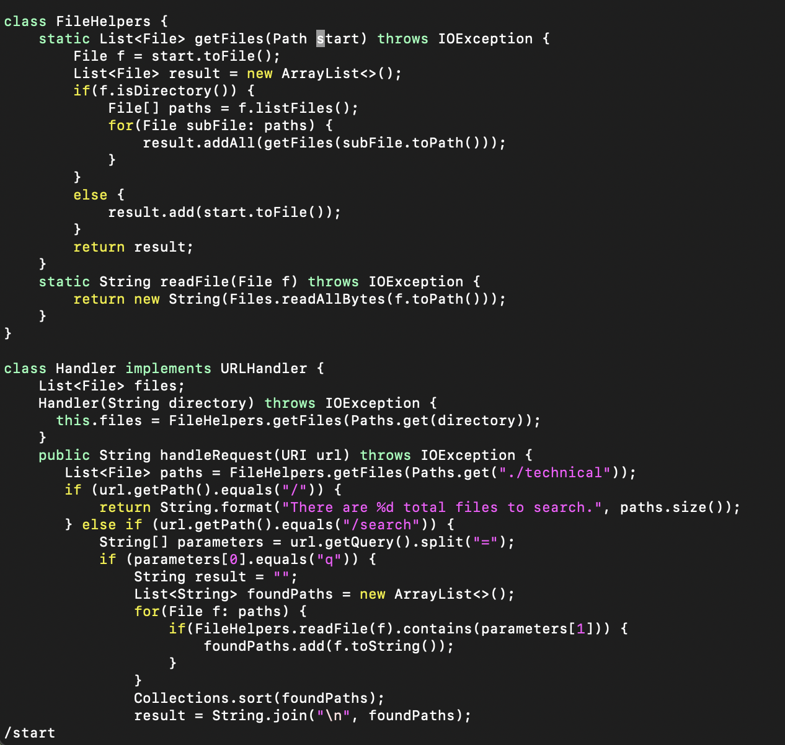
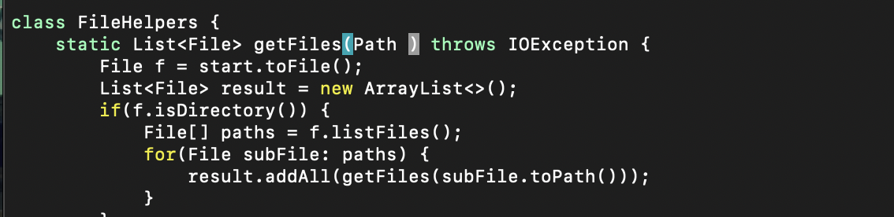
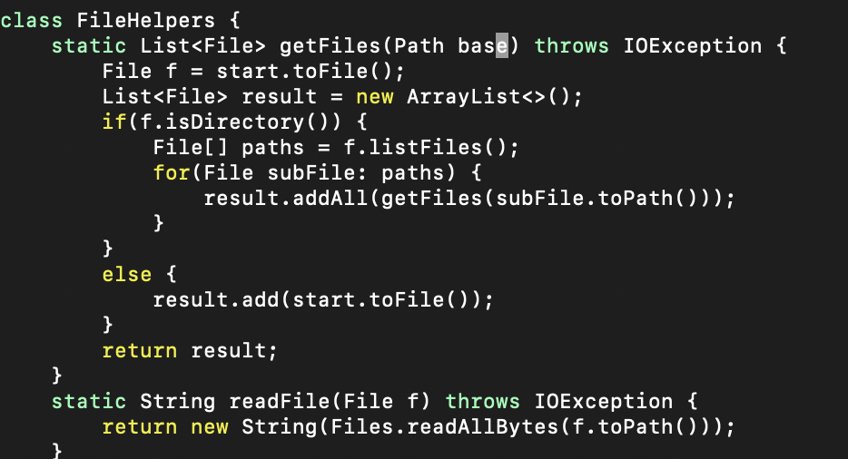
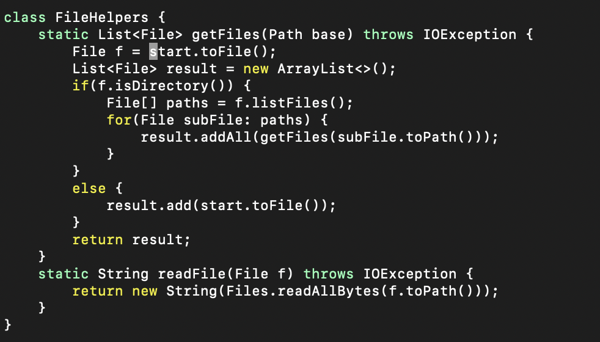
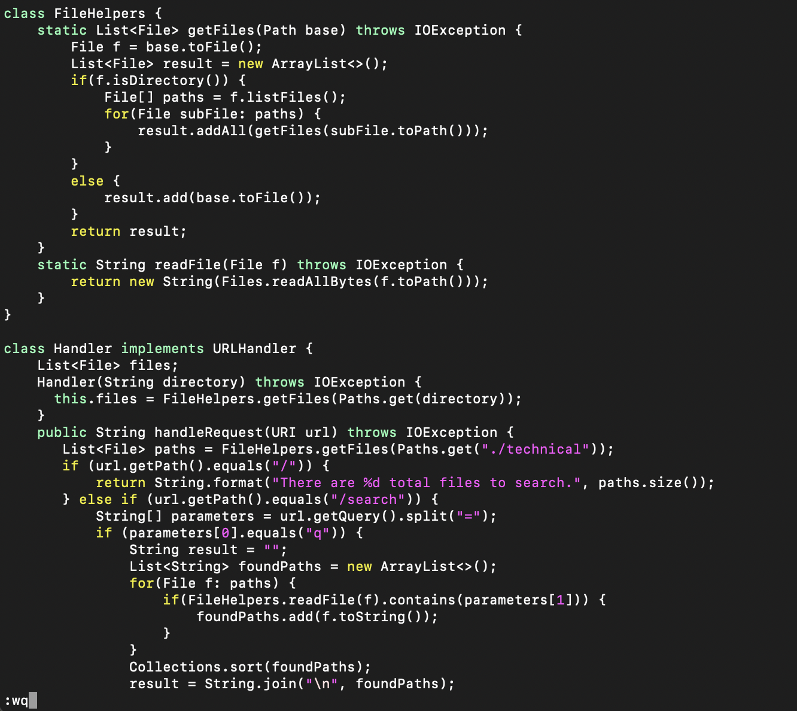

# **Week 7 Lab Report 4**

Our group chose the following task:

- Changing the name of the start parameter and its uses to base

The sequence of keys to press:
`/start<Enter>dwibase<Esc>n:wq<enter>`

`/start<Enter>`: `/` indicates that we are getting to the search. The following characters are our search target. In this case, we are searching for `start` and vim will hightlight the first `start`. After we press `<enter>`, the cursor now jumps to the start of `start`.

`dw`: the combination of `d` and `w` indicate that we are deleting the the word from current cursor to the start of the next word. In this case, our cursor start at `s` so it will delete everything after it until it finds the next word and now the cursor point at `)`.

`ibase<Esc>`: we press `i` get into the insert mode and replace the word to `base` and press `<Esc>` to go back to the normal mode. Now the cursor points at `e`.

`n`: Now we are back to normal mode and we press `n` to search for the next target that contains the word `start`. Now the cursor points at the start of next `start`.

Repeat `dwibase<Esc>n` until you replace all the `start` to `base`.

`:wq<Enter>`: we first press `:` to get to the command mode and then type `wq<Enter>` to save all the changes and exit the file.

If I start from the remote server, it took me around 39 second to finish the task and run the bash. If I start from VSCode, it took me around 1 min 15 seconds to finish the task and run the bash.

### **Which of these two styles would you prefer using if you had to work on a program that you were running remotely, and why?**

- I would use vim directly on the remote server beucase it is so convenience and I don't need to copy the file to the remote server after I finish editing. It saves time and work.

### **What about the project or task might factor into your decision one way or another? (If nothing would affect your decision, say so and why!)**

- I would still prefer using VSCode over Vim because I found it is hard to debug in the terminal window. It much more easier to debug using IDE.
