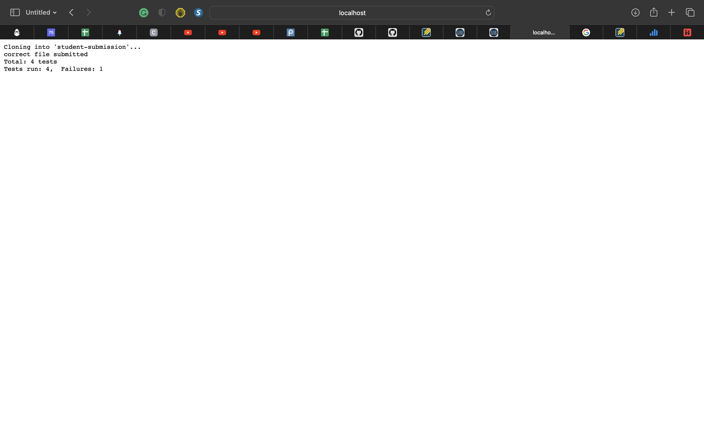

# **Week 8 Lab Report 5**

`grade.sh`

```
# Create your grading script here
set -e
CPATH=".:lib/hamcrest-core-1.3.jar:lib/junit-4.13.2.jar"
rm -rf student-submission
git clone $1 student-submission

# check file exist
if [[ -f "./student-submission/ListExamples.java" ]]
then
    echo "correct file submitted"
else
    echo "missing file"
fi

# copy the test & lib to student-submission
cp TestListExamples.java ./student-submission/
cp -r lib ./student-submission/
set +e
# compile the test & student code
cd student-submission
javac -cp $CPATH *.java
java -cp $CPATH org.junit.runner.JUnitCore TestListExamples 1> stdout

CHECK=$(grep -o "Failures" stdout)
PASS=$(grep -E -o ".{0,2}test.{0,0}" stdout)
FAILURE=$(grep -E -o "Failures.{0,3}" stdout)

# check how many passed tests
if [[ $CHECK ]]
    then
        echo "Total: 4 tests"
        grep "Failures" stdout
    else
        echo "Total: 4 tests"
        echo "You pass: $PASS"
fi
```

1. URL:
   https://github.com/ucsd-cse15l-f22/list-methods-lab3
   
2. URL:
   https://github.com/ucsd-cse15l-f22/list-methods-corrected
   
3. URL:
   https://github.com/ucsd-cse15l-f22/list-methods-compile-error
   

Using #2 as an example:

| Command                                                       | stdout                                             | stderr | exit code | if statement | explanation                                                                                                                                                                                                                                                                                                                                      |
| ------------------------------------------------------------- | -------------------------------------------------- | ------ | --------- | ------------ | ------------------------------------------------------------------------------------------------------------------------------------------------------------------------------------------------------------------------------------------------------------------------------------------------------------------------------------------------ |
| `rm -rf student-submission`                                   | empty                                              | empty  | 0         | N/A          | N/A                                                                                                                                                                                                                                                                                                                                              |
| `git clone $1 student-submission`                             | empty                                              | empty  | 0         | N/A          | N/A                                                                                                                                                                                                                                                                                                                                              |
| `if [[ -f "./student-submission/ListExamples.java" ]]`        | empty                                              | empty  | 0         | True         | ListExamples.java file can be found in student-submission folder. Therefore, it run if statement `echo "correct file submitted"` but won't run else statement `echo "missing file"`                                                                                                                                                              |
| `cp TestListExamples.java ./student-submission/`              | empty                                              | empty  | 0         | N/A          | N/A                                                                                                                                                                                                                                                                                                                                              |
| `cp -r lib ./student-submission/`                             | empty                                              | empty  | 0         | N/A          | N/A                                                                                                                                                                                                                                                                                                                                              |
| `cd student-submission`                                       | empty                                              | empty  | 0         | N/A          | N/A                                                                                                                                                                                                                                                                                                                                              |
| `javac -cp $CPATH *.java`                                     | empty                                              | empty  | 0         | N/A          | N/A                                                                                                                                                                                                                                                                                                                                              |
| `java -cp $CPATH org.junit.runner.JUnitCore TestListExamples` | `JUnit version 4.13.2....Time: 0.009 OK (4 tests)` | empty  | 0         | N/A          | N/A                                                                                                                                                                                                                                                                                                                                              |
| `if [[ $CHECK ]]`                                             | empty                                              | empty  | 0         | False        | `$CHECK` is going to search the word `"Failures"` if it exist in file `stdout`. In this case, since it pass all the tests, the word `"Failures"` is not existed in stdout. Therefore, it will run else statement `echo "Total: 4 tests"` and `echo "You pass: $PASS"` and skip if statement `echo "Total: 4 tests"` and `grep "Failures" stdout` |
| `if [[ $? -eq 0 ]]`                                           | empty                                              | empty  | 0         | True         | Since there's no error, it will run if statement `exit` and skip else statement `echo "test filed!"`                                                                                                                                                                                                                                             |

[Return to the main page](index.md)
